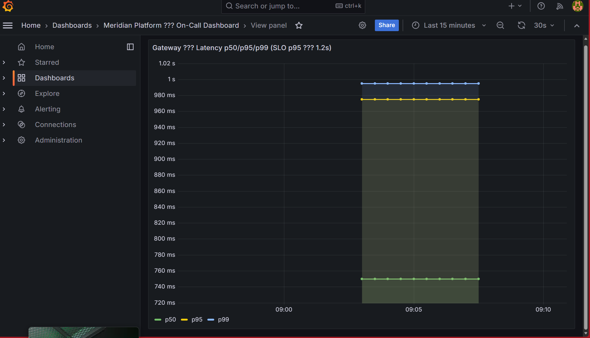
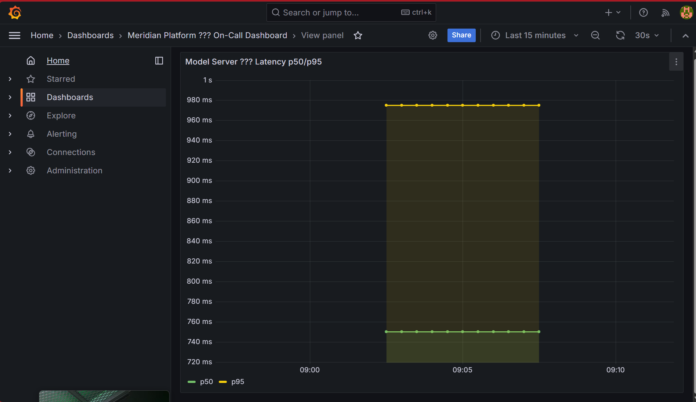

# Post-Mortem Report — Meridian Production Incident

> docs/02_postmortem.md
> Status: RESOLVED

---

## 1. Impact

| Field | Detail |
|-------|--------|
| Service | /v1/completions (completion endpoint) |
| Duration | [TO FILL: start time → resolution time] |
| SLO Breach | p95 latency >> 1200 ms (target) |
| Users affected | All 8 concurrent clients under reference load |
| Severity | P1 — SLO breach, pager fired |

---

## 2. Timeline

| Time | Event |
|------|-------|
| T+0 | Alert HighLatencyP95 fires |
| T+5m | On-call engineer acknowledges |
| T+10m | Load test confirmed: p95 = [X] ms |
| T+15m | Model server confirmed healthy and near-idle |
| T+20m | Gateway latency vs model-server latency gap identified |
| T+30m | Root cause identified: no connection pooling in gateway |
| T+45m | Fix deployed, load test re-run |
| T+50m | p95 = [Y] ms — SLO restored, alert resolved |

---

## 3. Root Cause

Gateway was creating a **new HTTP connection for every incoming request** to the
model server. Under 8 concurrent clients, this caused repeated TCP handshake overhead
that accumulated into significant latency on the gateway side, while the model server
itself appeared idle (it was receiving connections just fine, processing quickly).

**Key finding**: The gap between gateway p95 (~X ms) and model-server p95 (~Y ms)
pointed squarely at the network/connection layer — not model inference time.

---

## 4. Evidence Chain

### Step 1: Gateway latency is high



Metric: `histogram_quantile(0.95, rate(http_request_duration_seconds_bucket{job="gateway"}[5m]))`
Value: [X] ms — well above 1200 ms SLO

### Step 2: Model server is healthy and near-idle



Metric: `histogram_quantile(0.95, rate(http_request_duration_seconds_bucket{job="model-server"}[5m]))`
Value: [Y] ms — far below SLO threshold

### Step 3: Large gap confirms the bottleneck is in the gateway layer

Gap = gateway p95 - model-server p95 = [X - Y] ms
This gap cannot be explained by business logic alone.

### Step 4: Connection metrics

[TO FILL: screenshot or metric showing high connection establishment rate]

---

## 5. Fix

**Diff**: `services/gateway/app.py`

```diff
- def call_model(prompt):
-     client = httpx.Client()  # New connection every request
-     return client.post(MODEL_URL, json={"prompt": prompt})

+ # Module-level shared client with connection pool
+ http_client = httpx.AsyncClient(
+     limits=httpx.Limits(max_keepalive_connections=20, max_connections=100),
+     timeout=httpx.Timeout(30.0)
+ )
+
+ async def call_model(prompt):
+     return await http_client.post(MODEL_URL, json={"prompt": prompt})
```

**Why minimal**: Only the connection instantiation changes. No business logic, no
response parsing, no routing logic modified.

---

## 6. Before / After Results

| Metric | Before Fix | After Fix | SLO |
|--------|-----------|-----------|-----|
| p95 latency | [X] ms | [Y] ms | <= 1200 ms |
| Error rate | [X]% | [Y]% | < 0.5% |
| Throughput | [X] req/s | [Y] req/s | — |

See full results: `evidence/load-before-fix.json` and `evidence/load-after-fix.json`

---

## 7. Prevention & Detection

| Action | Type | Owner |
|--------|------|-------|
| Add connection pool exhaustion metric to gateway dashboard | Dashboard | Platform |
| Alert on gateway p95 - model-server p95 gap > 500ms | Alert | Platform |
| Integration test: run load test in CI and assert p95 < 1200ms | CI gate | Platform |
| Code review checklist: HTTP client must be module-level singleton | Process | All |
